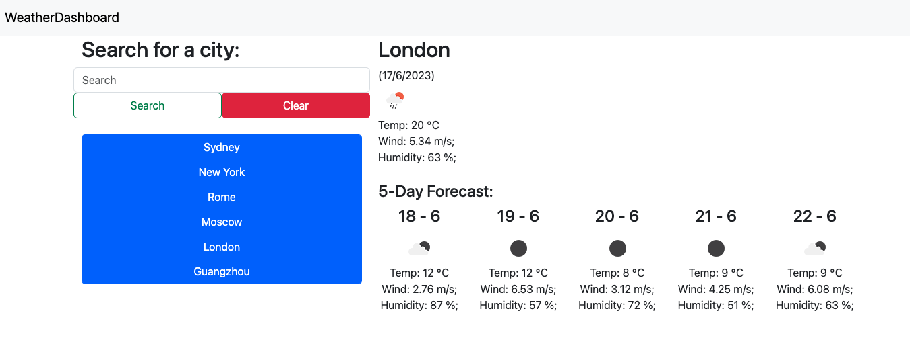

# weatherDashboard

## Description
A weather dashboard that will run in the browser and feature dynamically updated HTML and CSS

## Features:
- Search current weather based on the searched city 
- 5 days weather forecast of the search city
- Save the searched city, and load the city weather data onclick

## Usage:
- Open the weather Dashboard in a web browser
- Search the weather of a city by entering the city name in the search bar
- The weather result will be displayed and saved
- Click on the buttons with city names will load the current weather data of that city

## Project Sample

## Deployment
https://ruihang2017.github.io/weatherDashboard/

## License
Please refer to the LICENSE in the repo.

- - -
© 2023 RUIHANG HOU weatherDashboard. All rights reserved.